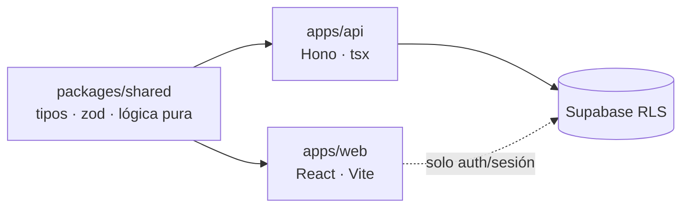

# Arquitectura de capas — ERP Codixia

Cómo se relacionan las apps con el paquete compartido y dónde termina el
código de `packages/shared` en desarrollo y producción.

## Paquete compartido (`packages/shared`)

Contrato único entre front y back. Solo código puro:

- `src/types.ts` y `src/tipos/` → tipos de dominio.
- `src/logica/*` → funciones puras + esquemas Zod (horas, slugs, horarios,
  formularios, mindmap, errores, invites).

No conoce la BD, ni Hono, ni React: cada capa adapta los datos y comparte la
validación/reglas.

## Diagrama

```
                ┌─────────────────────────────────────────────┐
                │        packages/shared (@erp/shared)        │
                │  types.ts · logica/* · esquemas Zod         │
                │  puro: sin BD, sin Hono, sin React          │
                └──────────┬───────────────────┬──────────────┘
                           │                   │
              import @erp/shared       import @erp/shared
              alias @/lib/*            alias @/lib/*
                           │                   │
                ┌──────────▼───────┐   ┌───────▼────────────┐
                │    apps/api      │   │     apps/web       │
                │  Hono + Zod      │   │  React + Vite      │
                │  tsx src/index   │   │  build → dist/     │
                └──────────┬───────┘   └───────┬────────────┘
                           │                   │
                      runtime Node        navegador
                      (Render)            (bundle JS)
                           │                   │
                           └──────► Supabase ◄─┘ (RLS)
```



## Desarrollo vs producción

|         | apps/api                                                          | apps/web                                          |
| ------- | ----------------------------------------------------------------- | ------------------------------------------------- |
| Dev     | `tsx watch` transpila `src/index.ts` y `shared/src/*.ts` al vuelo | Vite sirve `shared/src/*.ts` vía aliases          |
| Prod    | `tsx src/index.ts` en Render (transpila al vuelo)                 | `vite build` bundlea shared en `dist/assets/*.js` |
| Runtime | Node                                                              | navegador                                         |

`packages/shared` no se compila ni publica por separado (`private: true`,
`exports: . → src/index.ts`). Se transpila en el proceso de cada capa.

## Reglas de import

- Import canónico: `@erp/shared`.
- Aliases legacy de la migración Next.js: `@/lib/*` → `packages/shared/src/logica`
  (declarados en `apps/api/tsconfig.json`, `apps/web/tsconfig.json` y
  `apps/web/vite.config.ts`).
- Lógica necesaria en ambos lados va a `shared`; no duplicar en las apps.
