# Permisos: flujos, diagramas y casos

Documento visual del modelo v2 (migraciones 0071→0077). Reglas y guía
operativa en `docs/PERMISOS.md`; aquí están los flujos completos y los casos.

## Índice

1. [Capas y ubicación de la lógica](#1-capas-y-ubicación-de-la-lógica)
2. [Modelo de datos](#2-modelo-de-datos)
3. [Visibilidad y niveles](#3-visibilidad-y-niveles)
4. [Decisión de permiso efectivo](#4-decisión-de-permiso-efectivo)
5. [Flujo de lectura (SELECT)](#5-flujo-de-lectura-select)
6. [Flujo de creación](#6-flujo-de-creación)
7. [Flujo de compartir](#7-flujo-de-compartir)
8. [Herencia: casos con árbol](#8-herencia-casos-con-árbol)
9. [Tipos de usuario](#9-tipos-de-usuario)
10. [Ciclo de vida de una entidad](#10-ciclo-de-vida-de-una-entidad)
11. [Agregar un tipo nuevo](#11-agregar-un-tipo-nuevo)
12. [Endpoints y tablas del contrato](#12-endpoints-y-tablas-del-contrato)
13. [Tests](#13-tests)
14. [Invariantes y anti-patrones](#14-invariantes-y-anti-patrones)

---

## 1. Capas y ubicación de la lógica

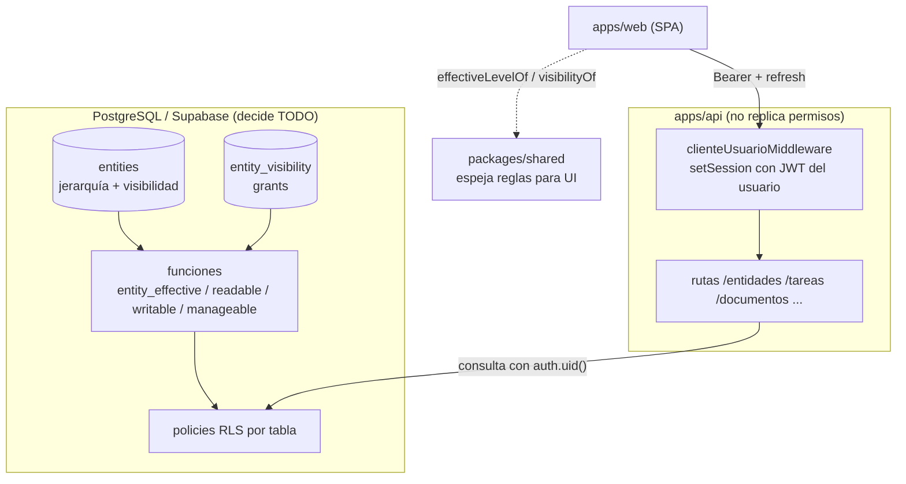

La API nunca decide: envía el JWT del usuario y Supabase aplica RLS. El SPA
solo previsualiza con `packages/shared` (debe espejar la misma semántica).

## 2. Modelo de datos

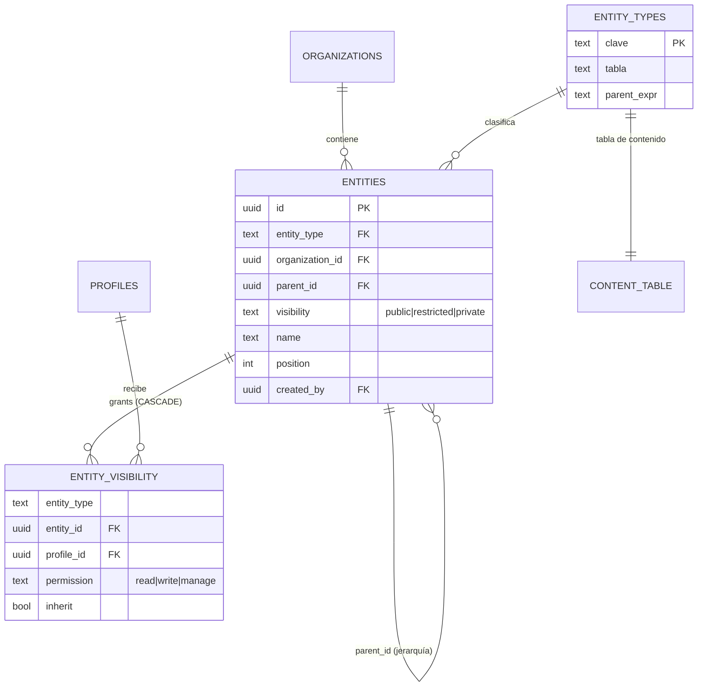

Registro actual de `entity_types`:

| clave        | tabla               | padre (`parent_expr`)                      |
| ------------ | ------------------- | ------------------------------------------ |
| `workspace`  | `workspaces`        | — (solo admin)                             |
| `folder`     | `workspace_folders` | `coalesce(parent_folder_id, workspace_id)` |
| `list`       | `task_lists`        | `coalesce(folder_id, workspace_id)`        |
| `document`   | `documents`         | `coalesce(folder_id, workspace_id)`        |
| `mindmap`    | `mind_maps`         | `coalesce(folder_id, workspace_id)`        |
| `todo`       | `todos`             | `coalesce(folder_id, workspace_id)`        |
| `formulario` | `formularios`       | `coalesce(folder_id, workspace_id)`        |

Tablas hijas (no están en `entity_types`, cuelgan de una entidad):

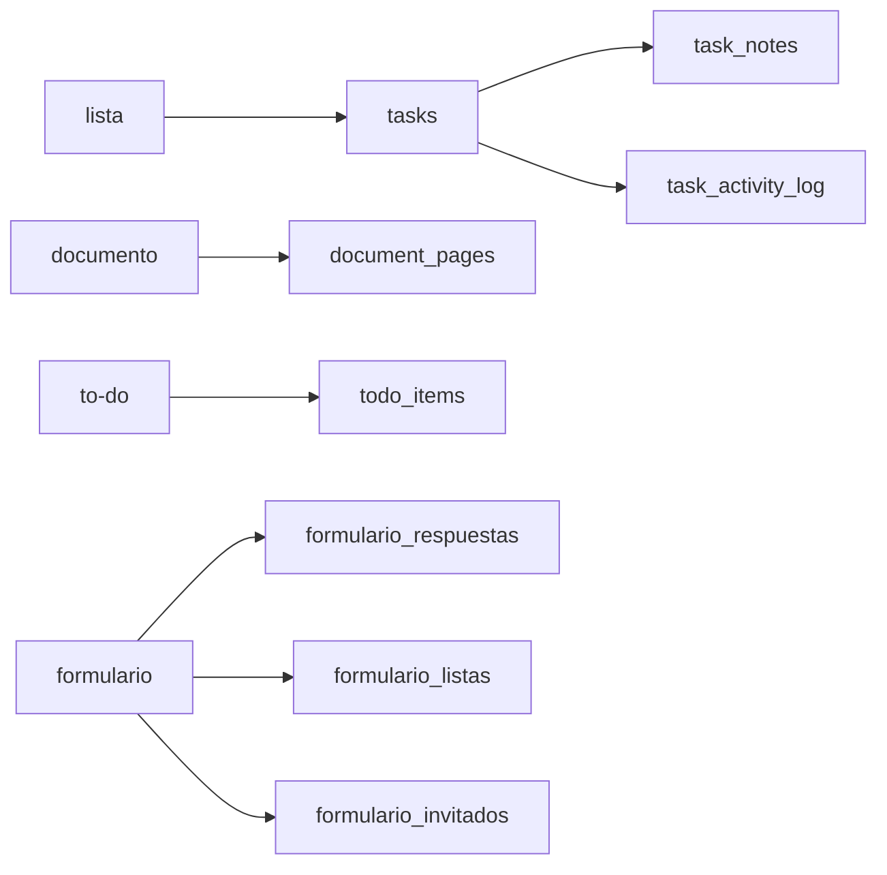

## 3. Visibilidad y niveles

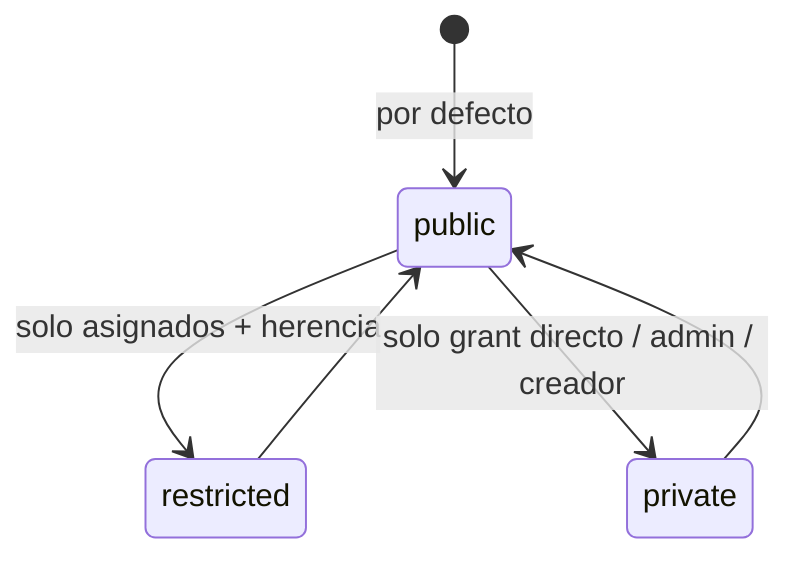

| Visibilidad  | Quién la ve                                           | Herencia de ancestros      |
| ------------ | ----------------------------------------------------- | -------------------------- |
| `public`     | Toda la organización (modo `org`) y quien tenga grant | Sí (capada a write)        |
| `restricted` | Personal asignado (grant directo) + herencia          | Sí (capada a write)        |
| `private`    | Solo grant directo, admin, creador                    | **No** (corta la herencia) |

| Nivel        | Puede                                                     |
| ------------ | --------------------------------------------------------- |
| `read` (1)   | Ver                                                       |
| `write` (2)  | Ver + crear dentro (si el contenedor es visible) + editar |
| `manage` (3) | Todo lo anterior + eliminar + compartir                   |

Regla de cap: cualquier permiso **heredado** se limita a `write`. Eliminar y
compartir exigen `manage` **directo** (o admin).

## 4. Decisión de permiso efectivo

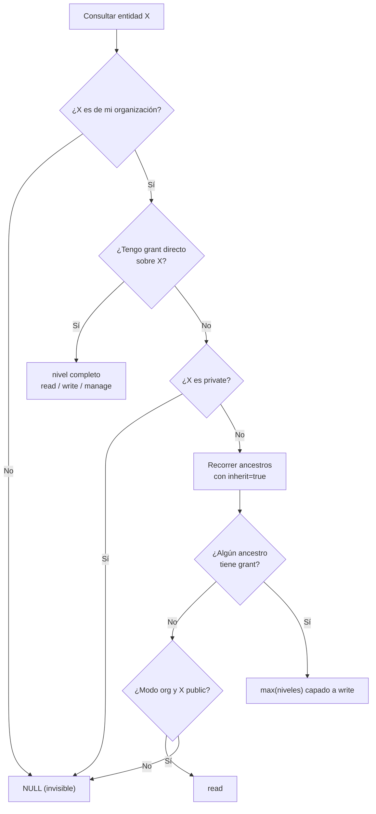

Funciones que implementan esto:

| Función                         | Devuelve                                   |
| ------------------------------- | ------------------------------------------ |
| `entity_effective(id)`          | nivel efectivo o NULL (la de arriba)       |
| `entity_readable(id)`           | admin ∨ effective ≠ NULL ∨ (org ∧ public)  |
| `entity_writable(id)`           | admin ∨ rank(effective) ≥ 2                |
| `entity_manageable(id)`         | admin ∨ rank(effective) ≥ 3                |
| `entity_navigation_visible(id)` | readable(id) ∨ algún descendiente readable |

## 5. Flujo de lectura (SELECT)

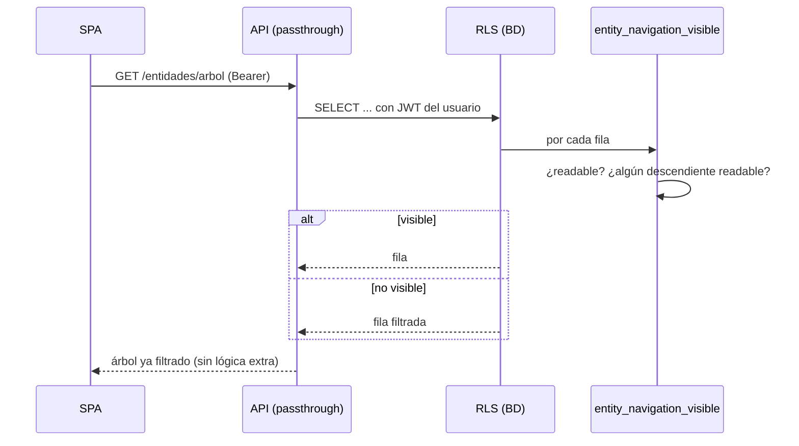

- Modo `org`: además de grants, ve todo lo `public` de su organización.
- Modo `grants_only`: solo grants (y los ancestros necesarios para navegar).
- Admin: todo lo de **su** organización (jamás otra).

## 6. Flujo de creación

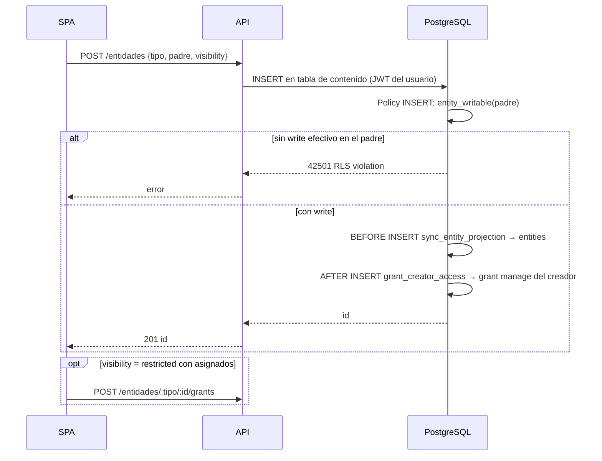

Claves del flujo:

- El padre debe ser **visible y escribible**: se acabó crear dentro de algo
  que no se ve.
- El creador recibe `manage` directo automático → siempre ve lo que creó.
- Los grants del creador se omiten si `auth.uid()` es NULL (service role/seeds).
- El trigger de proyección es **BEFORE** para que `grant_creator_access`
  (AFTER) ya encuentre la fila en `entities`.

## 7. Flujo de compartir

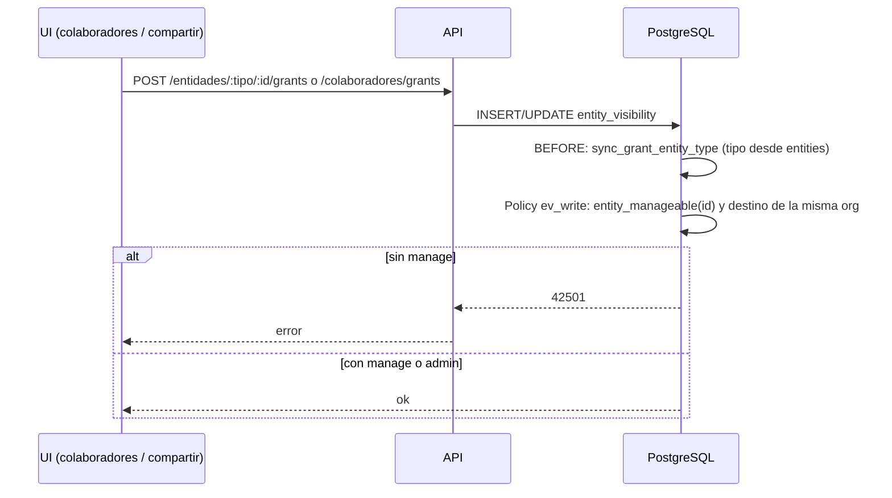

- `manage` puede compartir (antes solo admin).
- No se puede otorgar a perfiles de otra organización.
- El tipo del grant se deriva siempre de `entities` (no hay drift).
- Realtime: el SPA escucha `postgres_changes` de `entity_visibility` para
  refrescar accesos en vivo.

## 8. Herencia: casos con árbol

Árbol de ejemplo:

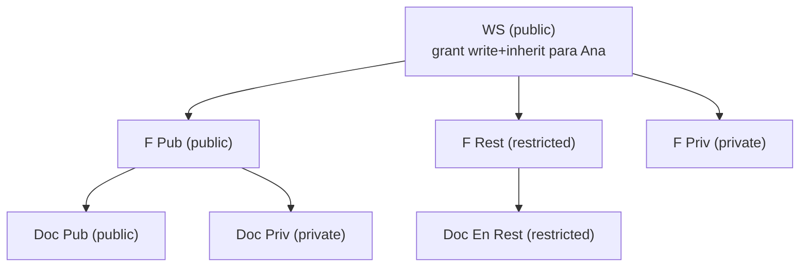

| Consulta de Ana | ¿Directo?  | Target     | Resultado | Motivo                    |
| --------------- | ---------- | ---------- | --------- | ------------------------- |
| `WS`            | sí (write) | public     | `write`   | grant directo             |
| `FP`            | no         | public     | `write`   | herencia capada           |
| `DP`            | no         | public     | `write`   | herencia capada           |
| `FR`            | no         | restricted | `write`   | restringido **sí** hereda |
| `DR`            | no         | restricted | `write`   | restringido **sí** hereda |
| `FPRI`          | no         | private    | `NULL`    | privado corta herencia    |
| `DPR`           | no         | private    | `NULL`    | privado corta herencia    |
| cualquier cosa  | —          | —          | eliminar  | requiere `manage` directo |

Otros casos:

| Caso                                    | Configuración            | Resultado                                                  |
| --------------------------------------- | ------------------------ | ---------------------------------------------------------- |
| Grant directo en hijo privado           | read en `DPR`            | visible (`read`)                                           |
| Grant en carpeta con subcarpeta privada | read en `FP`             | `FP`, `DP`, `DPR`? → `DPR` no (private), resto read capado |
| Grant manage heredado                   | manage en `WS`           | hijos heredan `write`, nunca borrar                        |
| Creador                                 | Ana creó `DPR` (private) | `manage` directo del trigger → lo ve                       |
| Sin grants, modo org                    | doc `public`             | `read`                                                     |
| Sin grants, modo grants_only            | doc `public`             | invisible                                                  |
| Grant en documento suelto               | read en `DP`             | Ana ve `DP` + `WS`/`FP` solo como navegación               |
| Otra organización                       | admin B                  | `NULL` en todo; INSERT/UPDATE/DELETE bloqueados            |

## 9. Tipos de usuario

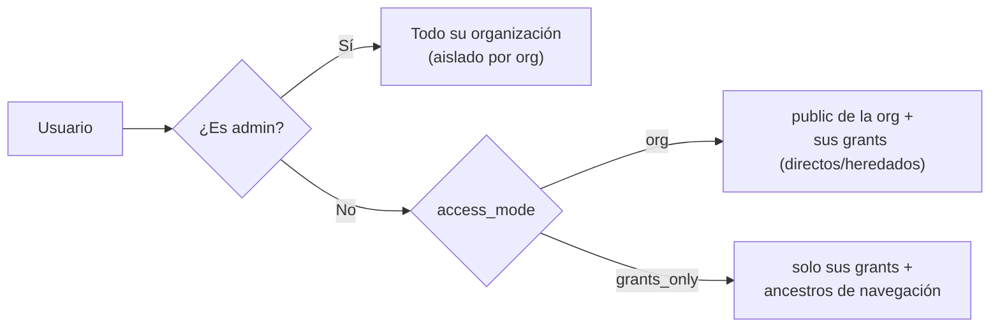

| Comportamiento          | admin      | colaborador `org`            | invitado `grants_only`       |
| ----------------------- | ---------- | ---------------------------- | ---------------------------- |
| Docs `public` sin grant | ve         | ve                           | no ve                        |
| Contenido con grant     | ve         | ve                           | ve                           |
| Navegación de ancestros | n/a        | no aplica                    | sí (solo ruta)               |
| Crear                   | todo (org) | con `write` en el contenedor | con `write` en el contenedor |
| Compartir               | sí         | solo con `manage`            | solo con `manage`            |

## 10. Ciclo de vida de una entidad

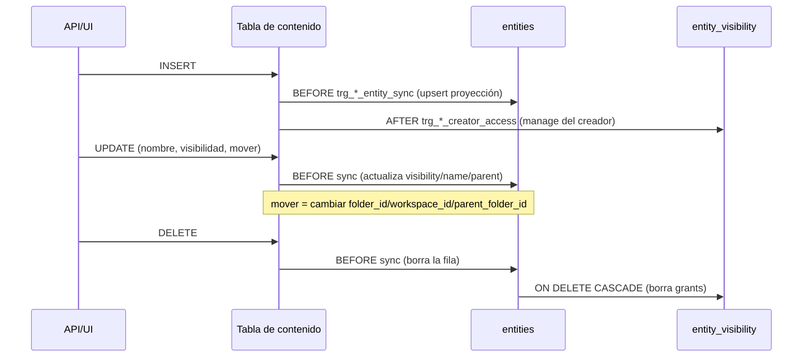

- Los UUID son **los mismos** en la tabla de contenido y en `entities`.
- Si el contenedor se borra y un hijo sobrevive (FK `SET NULL`), el trigger de
  sync reubica la proyección (el hijo sube de nivel).
- `mover` se recalcula por la expresión de padre del tipo (`parent_expr`).
- Hay triggers legacy `trg_ev_*` de limpieza de grants; el FK `CASCADE` ya lo
  cubre (se mantienen sin daño).

## 11. Agregar un tipo nuevo

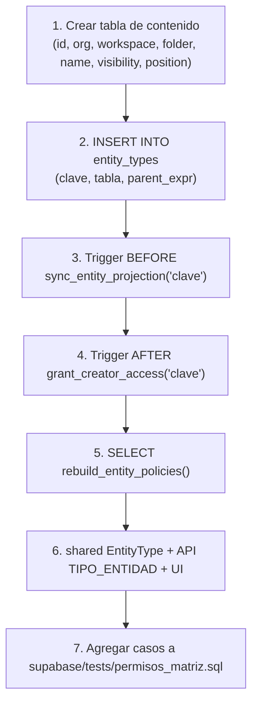

Con esto el tipo queda cubierto por: ver / crear / editar / borrar / compartir /
navegación / aislamiento por organización, sin tocar funciones ni policies a
mano.

## 12. Endpoints y tablas del contrato

| Endpoint                           | Uso                       | Permiso exigido por RLS |
| ---------------------------------- | ------------------------- | ----------------------- |
| `GET /entidades/arbol`             | árbol completo            | visibilidad por fila    |
| `GET /entidades/permiso?type&id`   | nivel efectivo            | lectura de la entidad   |
| `GET /entidades/grants?profile_id` | grants de un perfil       | propio grant o admin    |
| `POST /entidades`                  | crear                     | write en el contenedor  |
| `PATCH /entidades/:type/:id`       | editar/nombre/visibilidad | write                   |
| `POST /entidades/:type/:id/mover`  | cambiar de padre          | write                   |
| `POST /entidades/:type/:id/clonar` | clonar + copiar grants    | write                   |
| `POST /entidades/reordenar`        | posición batch            | write por fila          |
| `DELETE /entidades/:type/:id`      | eliminar                  | manage                  |
| `POST /entidades/:type/:id/grants` | compartir                 | manage                  |
| `POST /colaboradores/grants`       | otorgar acceso            | manage                  |
| `DELETE /colaboradores/grants`     | quitar acceso             | manage                  |

## 13. Tests

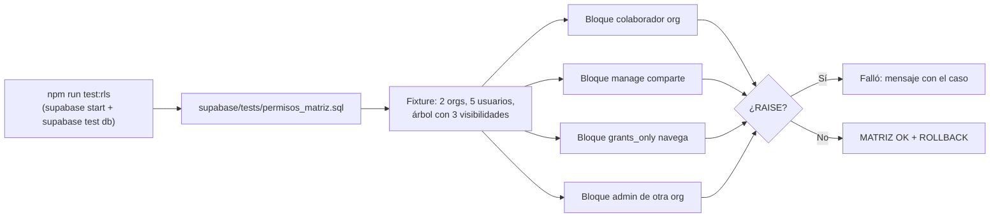

## 14. Invariantes y anti-patrones

Invariantes (no romper nunca):

1. Toda decisión de permiso vive en la BD; API y SPA no la replican.
2. Herencia: capada a write; solo `private` la corta.
3. Crear exige `write` efectivo de un contenedor visible.
4. Eliminar/compartir exigen `manage` (o admin).
5. Toda rama admin lleva `organization_id = get_my_org_id()`.
6. El trigger de proyección (`entities`) es BEFORE; el de creador, AFTER.
7. Grants y entidades comparten UUID; el tipo del grant se deriva de `entities`.

Anti-patrones:

- Añadir un tipo sin fila en `entity_types` / sin `rebuild_entity_policies()`.
- Consultar `entities` dentro de una policy (RLS sin policies → siempre falso):
  usar los helpers `entity_*` (son `SECURITY DEFINER`).
- Poner lógica de permisos en la API o en el SPA "para ir más rápido".
- Volver a propagar grants a mano (el workaround viejo ya no es necesario:
  la herencia cubre el caso).
- Duplicar la resolución de padre en SQL/TS: usar `entity_types` y
  `visibilityOf`/`effectiveLevelOf`.
